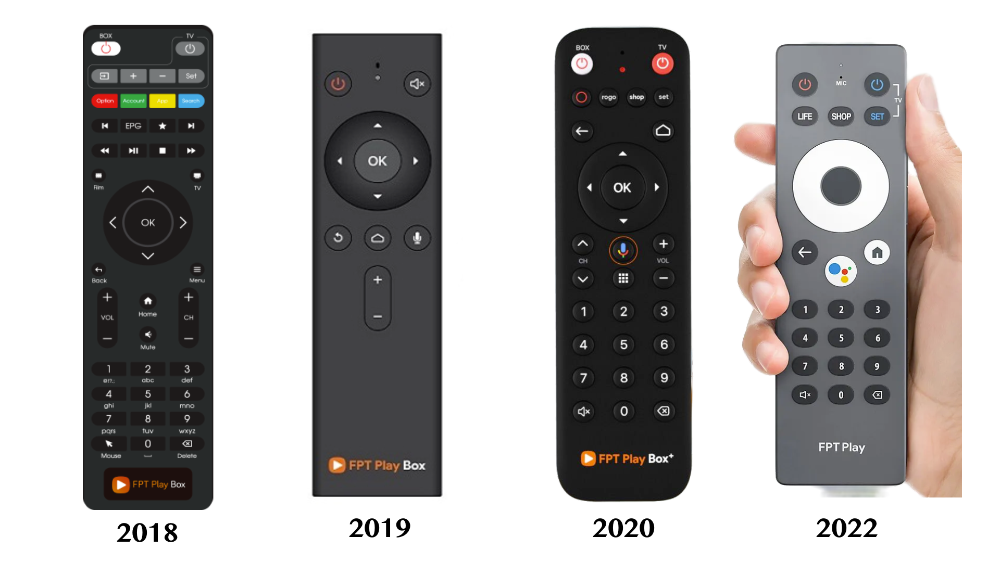
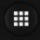
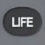

# FPT Play box voice remote

List of keys and key codes for FPT Play box from 2018 to 2022.

*For 2017, see [here](https://github.com/nhthai173/fpt-remote-2017)*

## Supported devices
- FPT Play Box S335 (2018)
- FPT Play Box S400 (2019)
- FPT Play Box 2G S500 (2019)
- FPT Play Box 2G T550 (2020)
- FPT Play Box S T590 (2021)
- FPT Play Box S650 (2022)

## Keys
- Function [[1]](#function-key)
- Number 0
- Number 1
- Number 2
- Number 3
- Number 4
- Number 5
- Number 6
- Number 7
- Number 8
- Number 9
- OK
- Back
- Home
- Channel up [[2]](#channel-up-key)
- Channel down [[3]](#channel-down-key)
- Volume up
- Volume down
- Mute
- Power
- Up
- Down
- Left
- Right
- Backspace
- App [[4]](#app-key)
- Assistant
- Rogo [[5]](#rogo-key)
- Shop

### Function key
Function key  
Has been removed from 2022 version.

### Channel up key
Channel up key  
Has been removed from 2022 version.

### Channel down key
Channel down key  
Has been removed from 2022 version.

### App key
App key  
Has been removed from 2022 version.

### Rogo key
Rogo key  
Life key  
Has been renamed to ***Life*** from 2022 version.
